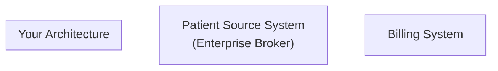

# Rounding App - Backend Take-Home Assignment

## Role Context

You'll be responsible for setting engineering direction, establishing patterns and practices, and making architectural decisions. We want to see how you think about building systems that are:

- Appropriate for the project's scope and complexity
- Ready to grow as the team and organization scale
- Built to last rather than built to impress

---

## Background

The Rounding App backend powers healthcare providers (doctors, nurses, specialists) as they visit patients in hospitals. The system enables providers to document patient encounters, enter charges for services performed, and submit billing information.

**Important**: This is a backend-focused assignment. You are building the server-side components only. The mobile app is developed separately and will consume your APIs.

### Current State

- The Patient Source System and Billing System are external systems maintained by other teams
- You need to build this application from scratch

### Integration Points

Multiple Patient Source Software systems may exist at each hospital (e.g., EHR systems, scheduling systems). An enterprise message broker (e.g., Iguana) aggregates and normalizes messages from these diverse sources before delivering them to your system.

**Patient Source System (Enterprise Integration)**

- Multiple source systems at each hospital feed into a central enterprise message broker
- The broker normalizes messages into a standard format
- Uses a message-based integration with near real-time delivery
- May occasionally send duplicate messages
- Your app is the consumer; source systems are the authoritative sources
- Supports the following event types:
  - `PATIENT_ASSIGNMENT` — Provider assigned to a patient
  - `PATIENT_UNASSIGNMENT` — Provider unassigned from a patient
  - `PATIENT_UPDATE` — Patient demographics changed
  - `VISIT_ADMISSION` — New patient visit created
  - `VISIT_LOCATION_CHANGE` — Patient room/unit changed
  - `VISIT_DISCHARGE` — Patient discharged

**Billing System (Per Hospital)**

- Each hospital may have its own Billing System instance
- Accepts charge submissions via a REST API
- Provides synchronous acknowledgment/confirmation
- May be temporarily unavailable (5xx errors, timeouts)
- Supports validation and partial acceptance

### Users

Healthcare providers who access the system via mobile devices. They may:

- Work in areas with poor network connectivity
- Need to save work in progress and continue later
- Require audit trails for compliance

---

## Requirements

### Core Functionality

1. **Patient Data Management**
   - Receive and store patient assignments, demographics, allergies, conditions, and medications
   - Receive and store visit details and patient location within the hospital
   - Associate patients with providers

2. **Charge Processing**
   - Accept charge entries per patient encounter
   - Each charge includes: service code, quantity, date of service, optional modifiers
   - Support clinical notes attached to charges
   - Allow saving work in progress without submitting

3. **Billing Submission**
   - Submit completed charges to the Billing System
   - Handle submission failures gracefully
   - Support retry of failed submissions

4. **Offline Sync Coordination**
   - Handle burst of data when mobile devices come back online after connectivity loss
   - Detect and handle duplicate submissions (the same charge submitted multiple times due to network issues or retries)
   - Maintain data consistency across offline periods
   - Ensure charges are submitted to the Billing System exactly once (even if the mobile app retries)

### Non-Functional Requirements

1. **Multi-Tenancy**: Support multiple hospitals from a single deployment
2. **Security**: Handle sensitive patient health information (PHI) securely
3. **Auditing**: Maintain complete audit trails for compliance
4. **Reliability**: Continue operating during temporary outages of external systems
5. **Scalability**: Support growth in users and hospitals

---

## Assignment

Design and implement the core components of the Rounding App backend. You may choose any technology stack you're comfortable with, but be prepared to justify your choices.

### Part 1: Architecture Design

Provide a comprehensive architecture document that includes:

#### 1.1 System Architecture Diagram

Create a high-level architecture diagram showing:

- Major components and their boundaries
- Communication patterns between components
- External system integrations (Patient Source System, Billing System)
- Data flow directions
- Where multi-tenancy is handled



**Note**: Use Mermaid diagram syntax in your Markdown file. The diagram should clearly show how data flows from external systems through your components.

#### 1.2 Module Organization

Explain how you've organized the codebase into modules/components. Consider:

- What are the natural boundaries between different parts of the system?
- How do these modules interact with each other?
- How does your module structure reflect the project's scope and complexity?
- What is your strategy for organizing code that can be understood and maintained easily?

#### 1.3 Data Model Design

Design the core data model covering:

- Patient and provider entities
- Charge and note structures
- Audit/telemetry requirements
- How you'll handle multi-tenancy at the data level

```mermaid
erDiagram
    %% Add your entities here
```

### Part 2: Key Component Implementation

Implement at least two of the following components in code:

**Option A: Charge Submission Service**

- Accept charge submissions from providers
- Validate charges against business rules
- Send to Billing System with retry logic
- Handle acknowledgments and failures

**Option B: Patient Sync Service**

- Consume messages from Patient Source System
- Process and store patient data
- Handle duplicate detection
- Maintain synchronization state

**Option C: Offline Sync Coordinator**

- Track pending changes from mobile clients
- Detect conflicts
- Coordinate sync when connectivity returns
- Ensure exactly-once delivery to Billing System

### Part 3: Integration Design

For the Patient Source System integration:

1. **Message Contract Design**
   - What does the incoming message look like?
   - How do you handle schema evolution?

2. **Consumer Implementation**
   - How do you process messages reliably?
   - What happens when processing fails partway through?

3. **Idempotency Strategy**
   - How do you detect and handle duplicate messages?
   - What is your deduplication strategy?

### Part 4: Resiliency Patterns

Document how your system handles:

1. **Billing System Outage**
   - What happens when Billing System is unavailable?
   - How do you recover when it comes back?
   - How do you ensure charges aren't lost during an outage?

2. **Offline Sync**
   - How does your system handle burst submissions when devices come back online?
   - How do you detect and resolve conflicts from offline periods?
   - How do you prevent the same charge from being submitted to the Billing System multiple times (exactly-once delivery)?

3. **Partial Failures**
   - What happens if a charge submission partially succeeds (some charges accepted, some rejected)?
   - How do you decide what to retry and what to surface to the provider?
   - How do you maintain consistency between your system and the Billing System?

---

## Deliverables

1. **Architecture Document** (Markdown)
   - Architecture diagram using Mermaid
   - Module organization explanation
   - Data model design (ER diagram using Mermaid)
   - Rationale for key decisions

2. **Code Implementation**
   - Working code for at least 2 core components
   - Clear module structure
   - README explaining how to run the system

3. **Integration Specification** (for Patient Source System)
   - Message schema definition
   - Processing flow description
   - Error handling strategy

**Submission Format:**

- You will NOT submit your code to us directly.
- The code must be runnable on your local machine.
- We recommend containerizing your solution (Docker/docker-compose) to simplify setup.
- We'll schedule a 60-90 minute call where you walk us through your design and demonstrate the running system.
- Be prepared to discuss your architectural decisions, trade-offs you considered, and what you might change with more time.

---

## What We're Looking For

### Architecture Thinking

- **Appropriate complexity**: Systems that match the project's scope and complexity—not over-engineered, not under-engineered.
- **Modular boundaries**: Clear separation that enables independent development and future extraction.
- **Trade-off awareness**: Understanding that every architectural decision involves trade-offs.

### Technical Execution

- Code that is clean, readable, and follows consistent patterns
- Proper error handling at boundaries
- A runnable solution that actually works end-to-end
- Demonstrates understanding of backend concerns: data integrity, external system integration, and reliable processing

### Healthcare Domain Awareness

- Understanding why auditing matters
- Thinking about data sensitivity
- Recognizing the cost of downtime in healthcare settings

### Communication

- Clear documentation that helps others understand your design
- Reasoning behind decisions, not just the decisions themselves
- Ability to articulate your thought process during the discussion

---

## Time Expectation

We expect this assignment to take approximately **one week** of focused work. You can work at your own pace—this isn't a sprint. Use the time to build something you're proud of and that demonstrates your thinking.

### Recommended Setup

To make your solution easy to run and demonstrate:

- **Containerization**: Use Docker with docker-compose to package your application and dependencies. This ensures your solution runs identically on your machine and ours.
- **Mock External Systems**: Include mock implementations of the Patient Source System message consumer and Billing System API so your system can run standalone without connecting to external infrastructure.
- **Sample Data**: Seed your database with realistic test data (patients, providers, visits) to demonstrate the full flow.

### What Not to Spend Time On

Focus your energy on the backend core:

- **Don't build**: Mobile apps, web UIs, or sophisticated frontend frameworks
- **Don't over-engineer**: Elaborate CI/CD pipelines, microservices for the sake of microservices, or production-grade infrastructure
- **Don't skip**: Core backend concerns like error handling, data consistency, and external system integration patterns

We're evaluating your backend architecture thinking, not your DevOps sophistication or UI skills.

### During the Call

We'll discuss:

- Your architecture and the reasoning behind your design decisions
- How you organized your modules and why
- Edge cases you considered and how you handled them
- What you'd do differently with more time or a larger scope
- Code walkthrough of key components

Feel free to bring notes, diagrams, or anything else that helps you explain your thinking.

---

## Submission

You will NOT submit your code to us directly. Instead:

1. Keep your code on your local machine, ready to run and demonstrate
2. Schedule a call with us when you're ready (aim for within one week of receiving this assignment)
3. During the 60-90 minute call, you'll walk us through your architecture and demonstrate the running system

**Need more time?** If you need an extension, just ask. We understand life happens. Better to deliver quality work on a revised timeline than to rush and submit something you're not proud of.

Before the call, make sure:

- Your solution runs with a single `docker-compose up` command (or equivalent)
- The system includes mocks for the external Patient Source System consumer and Billing System API—no external infrastructure required
- You have seed data loaded to demonstrate the flow
- You've reviewed your code so you can explain it confidently
- You can spin up your IDE and navigate through key files during the discussion

If you have questions about the requirements before the call, please reach out. It's better to clarify now than to make assumptions that diverge from what we expect.

---

## Appendix: FAQ

**Q: Do I need to build the mobile app?**
No. This is a backend-only assignment. Build the server-side components that would power the mobile app.

**Q: Do I need to connect to real Patient Source System or Billing System infrastructure?**
No. Include mock implementations in your solution so it runs standalone. During the call, we may discuss how your design would change when integrating with real infrastructure.

**Q: How complex should the mock implementations be?**
Just enough to demonstrate that your core logic works. A simple in-memory mock or a stub that returns realistic responses is sufficient.

**Q: What level of authentication/authorization do I need?**
Focus on the core business logic. A simple provider authentication mechanism is fine—we're evaluating your architectural decisions and backend design, not your auth implementation.

**Q: How should I handle multi-tenancy?**
Include multi-tenancy in your data model and API design. For the mock implementation, demonstrating with a single hospital is acceptable as long as your design supports multiple.

**Q: How much detail should the architecture document have?**
Enough to communicate your design decisions clearly. Include diagrams, module explanations, and rationale. A few well-written pages is better than an exhaustive treatise.

**Q: Should I include API documentation for my implementation?**
Basic API documentation is helpful but not required. Focus on code quality and architecture over paperwork.

**Q: What if I can't finish everything?**
Submit what you have. During the call, we'll discuss what you completed and what trade-offs you made. Quality over completeness is valued.

---

## Appendix: Context We Won't Provide (Make Reasonable Assumptions)

- Technology stack (use what you're comfortable with)
- Specific database technology
- CI/CD tooling
- Hosting infrastructure
- Authentication provider
- Team size

These are implementation details you'll decide as part of your design. Be prepared to explain why you made your choices based on the project's scope and requirements—not assumptions about team size or hypothetical future scale.

---

## Appendix: Patient Source System Integration

The enterprise message broker aggregates messages from multiple Patient Source Software systems at each hospital and delivers them to your system. You will configure one connection per hospital to consume from the enterprise broker.

### Connection Configuration

```yaml
# Example: Hospital broker connection configuration
hospitals:
  - id: HOSP-001
    name: "Memorial Hospital"
    broker:
      host: broker.memorial.example.com
      port: 5672
      queue: rounding_app_patients
      exchange: enterprise_events
      routing_key: patient.#
  - id: HOSP-002
    name: "City Medical Center"
    broker:
      host: broker.city.example.com
      port: 5672
      queue: rounding_app_patients
      exchange: enterprise_events
      routing_key: patient.#
```

### Message Envelope

All messages share a common envelope structure:

```json
{
  "messageId": "MSG-2024-001-UUID",
  "eventType": "PATIENT_ASSIGNMENT",
  "timestamp": "2024-01-15T09:30:00Z",
  "source": "PatientSourceSystem",
  "hospitalId": "HOSP-001",
  "correlationId": "REQ-123",
  "version": "1.0",
  "payload": {}
}
```

| Field           | Type    | Description                                                |
| --------------- | ------- | ---------------------------------------------------------- |
| `messageId`     | string  | Unique identifier for this message (use for deduplication) |
| `eventType`     | string  | Type of event (see below)                                  |
| `timestamp`     | ISO8601 | When the event occurred at the source                      |
| `source`        | string  | Originating system identifier                              |
| `hospitalId`    | string  | Hospital this message belongs to                           |
| `correlationId` | string  | Optional. Links related messages together                  |
| `version`       | string  | Schema version for this message                            |
| `payload`       | object  | Event-specific data                                        |

### Event Types

#### PATIENT_ASSIGNMENT

Triggered when a provider is assigned to a patient.

```json
{
  "messageId": "MSG-001",
  "eventType": "PATIENT_ASSIGNMENT",
  "timestamp": "2024-01-15T09:30:00Z",
  "source": "PatientSourceSystem",
  "hospitalId": "HOSP-001",
  "version": "1.0",
  "payload": {
    "assignmentId": "ASSIGN-123",
    "patient": {
      "id": "PAT-456",
      "mrn": "MRN-123456",
      "firstName": "Jane",
      "lastName": "Doe",
      "dateOfBirth": "1985-03-20",
      "gender": "F",
      "address": {
        "street": "123 Main St",
        "city": "Boston",
        "state": "MA",
        "zip": "02101"
      },
      "phone": "617-555-0100",
      "emergencyContact": {
        "name": "John Doe",
        "relationship": "Spouse",
        "phone": "617-555-0101"
      }
    },
    "provider": {
      "id": "PROV-789",
      "npi": "1234567890",
      "name": "Dr. John Smith",
      "specialty": "Internal Medicine"
    },
    "visit": {
      "id": "VISIT-001",
      "admissionDate": "2024-01-14T08:00:00Z",
      "room": "301A",
      "bed": "1",
      "unit": "Cardiology",
      "status": "ACTIVE",
      "admittingDiagnosis": "Chest pain"
    },
    "assignedAt": "2024-01-15T09:30:00Z"
  }
}
```

#### PATIENT_UPDATE

Triggered when patient demographics change.

```json
{
  "messageId": "MSG-002",
  "eventType": "PATIENT_UPDATE",
  "timestamp": "2024-01-15T10:00:00Z",
  "source": "PatientSourceSystem",
  "hospitalId": "HOSP-001",
  "version": "1.0",
  "payload": {
    "patientId": "PAT-456",
    "mrn": "MRN-123456",
    "changes": {
      "phone": {
        "old": "617-555-0100",
        "new": "617-555-0200"
      }
    },
    "updatedAt": "2024-01-15T10:00:00Z"
  }
}
```

#### VISIT_LOCATION_CHANGE

Triggered when a patient is moved within the hospital.

```json
{
  "messageId": "MSG-003",
  "eventType": "VISIT_LOCATION_CHANGE",
  "timestamp": "2024-01-15T11:00:00Z",
  "source": "PatientSourceSystem",
  "hospitalId": "HOSP-001",
  "version": "1.0",
  "payload": {
    "visitId": "VISIT-001",
    "patientId": "PAT-456",
    "previousLocation": {
      "room": "301A",
      "bed": "1",
      "unit": "Cardiology"
    },
    "newLocation": {
      "room": "401B",
      "bed": "2",
      "unit": "ICU"
    },
    "changedAt": "2024-01-15T11:00:00Z",
    "reason": "Patient condition escalated"
  }
}
```

#### VISIT_DISCHARGE

Triggered when a patient is discharged.

```json
{
  "messageId": "MSG-004",
  "eventType": "VISIT_DISCHARGE",
  "timestamp": "2024-01-16T14:00:00Z",
  "source": "PatientSourceSystem",
  "hospitalId": "HOSP-001",
  "version": "1.0",
  "payload": {
    "visitId": "VISIT-001",
    "patientId": "PAT-456",
    "dischargeDate": "2024-01-16T14:00:00Z",
    "dischargeStatus": "HOME",
    "dischargeInstructions": "Rest for 2 weeks. Follow up in 7 days.",
    "providerId": "PROV-789"
  }
}
```

### Processing Requirements

1. **Deduplication**: Use `messageId` to detect and ignore duplicate messages. The broker may redeliver messages during network issues or consumer restarts.

2. **Ordering**: Messages for the same patient/visit should be processed in timestamp order. However, messages for different patients can be processed in parallel.

3. **Error Handling**: If processing fails, the message will be redelivered. Implement idempotent processing so redelivery is safe.

4. **Schema Evolution**: The `version` field indicates the schema version. Plan for graceful handling of future versions.

5. **Consumer Pattern**: The broker uses a competing consumer pattern—multiple instances of your application can consume from the same queue. Design for this from the start.

---

## Appendix: Billing System Integration

The Billing System exposes a REST API for submitting charges. Each hospital may have their own Billing System instance.

### Base Configuration

```yaml
# Example: Hospital-specific billing configuration
hospitals:
  - id: HOSP-001
    name: "Memorial Hospital"
    billing:
      base_url: https://billing-memorial.example.com/api/v1
      timeout: 30s
      retry:
        max_attempts: 3
        initial_delay: 1s
        max_delay: 30s
  - id: HOSP-002
    name: "City Medical Center"
    billing:
      base_url: https://billing-city.example.com/api/v1
      timeout: 30s
```

### Submit Charges

**Endpoint**: `POST /charges/submit`

Submits one or more charges for billing.

**Request**:

```http
POST /api/v1/charges/submit
Content-Type: application/json
X-Correlation-Id: CORR-123
X-Hospital-Id: HOSP-001

{
  "submissionId": "SUB-2024-001-UUID",
  "providerId": "PROV-789",
  "providerNpi": "1234567890",
  "hospitalId": "HOSP-001",
  "patientId": "PAT-456",
  "patientMrn": "MRN-123456",
  "visitId": "VISIT-001",
  "charges": [
    {
      "chargeId": "CHG-001",
      "serviceCode": "99213",
      "description": "Office visit, established patient",
      "quantity": 1,
      "unitPrice": 150.00,
      "dateOfService": "2024-01-15",
      "modifiers": ["25"],
      "notes": "Brief history and medical decision making, moderate complexity"
    },
    {
      "chargeId": "CHG-002",
      "serviceCode": "36415",
      "description": "Venipuncture",
      "quantity": 1,
      "unitPrice": 25.00,
      "dateOfService": "2024-01-15",
      "modifiers": [],
      "notes": null
    }
  ],
  "submittedAt": "2024-01-15T16:30:00Z",
  "clientSubmissionId": "CLIENT-UUID"
}
```

**Field Definitions**:

| Field                     | Required | Description                                         |
| ------------------------- | -------- | --------------------------------------------------- |
| `submissionId`            | Yes      | Your system's unique identifier for this submission |
| `providerId`              | Yes      | Provider identifier in your system                  |
| `providerNpi`             | Yes      | National Provider Identifier (10 digits)            |
| `hospitalId`              | Yes      | Hospital identifier                                 |
| `patientId`               | Yes      | Patient identifier in your system                   |
| `patientMrn`              | Yes      | Medical Record Number                               |
| `visitId`                 | Yes      | Visit/encounter identifier                          |
| `charges`                 | Yes      | Array of 1-100 charge items                         |
| `charges[].chargeId`      | Yes      | Unique identifier for this charge                   |
| `charges[].serviceCode`   | Yes      | CPT/HCPCS code                                      |
| `charges[].description`   | No       | Human-readable description                          |
| `charges[].quantity`      | Yes      | Number of units (positive integer)                  |
| `charges[].unitPrice`     | No       | Price per unit in USD                               |
| `charges[].dateOfService` | Yes      | Date service was performed (YYYY-MM-DD)             |
| `charges[].modifiers`     | No       | Array of CPT modifiers                              |
| `charges[].notes`         | No       | Clinical notes (max 2000 chars)                     |
| `submittedAt`             | Yes      | ISO8601 timestamp of submission                     |
| `clientSubmissionId`      | Yes      | Idempotency key for the client                      |

**Success Response** (HTTP 200):

```json
{
  "submissionId": "SUB-2024-001-UUID",
  "status": "ACCEPTED",
  "acceptedAt": "2024-01-15T16:30:01Z",
  "billingReference": "BILL-789012",
  "acceptedCharges": [
    {
      "chargeId": "CHG-001",
      "billingCode": "99213-25",
      "status": "ACCEPTED"
    },
    {
      "chargeId": "CHG-002",
      "billingCode": "36415",
      "status": "ACCEPTED"
    }
  ]
}
```

**Partial Acceptance Response** (HTTP 200):

```json
{
  "submissionId": "SUB-2024-001-UUID",
  "status": "PARTIAL",
  "acceptedAt": "2024-01-15T16:30:01Z",
  "billingReference": "BILL-789012",
  "acceptedCharges": [
    {
      "chargeId": "CHG-001",
      "billingCode": "99213-25",
      "status": "ACCEPTED"
    }
  ],
  "rejectedCharges": [
    {
      "chargeId": "CHG-002",
      "status": "REJECTED",
      "error": {
        "code": "INVALID_SERVICE_CODE",
        "message": "Service code 36415 is not valid for department 12"
      }
    }
  ]
}
```

**Rejection Response** (HTTP 200):

```json
{
  "submissionId": "SUB-2024-001-UUID",
  "status": "REJECTED",
  "rejectedAt": "2024-01-15T16:30:01Z",
  "rejectedCharges": [
    {
      "chargeId": "CHG-001",
      "status": "REJECTED",
      "error": {
        "code": "INVALID_SERVICE_CODE",
        "message": "Service code 99999 is not recognized"
      }
    },
    {
      "chargeId": "CHG-002",
      "status": "REJECTED",
      "error": {
        "code": "INVALID_MODIFIER",
        "message": "Modifier 99 is not valid for service code 36415"
      }
    }
  ]
}
```

**Transient Error Response** (HTTP 503):

```json
{
  "error": {
    "code": "SERVICE_UNAVAILABLE",
    "message": "Billing system is temporarily unavailable. Please retry.",
    "retryAfter": 30
  }
}
```

**Validation Error Response** (HTTP 400):

```json
{
  "error": {
    "code": "VALIDATION_ERROR",
    "message": "Request validation failed",
    "details": [
      {
        "field": "charges[0].serviceCode",
        "message": "Service code is required"
      },
      {
        "field": "charges[1].quantity",
        "message": "Quantity must be a positive integer"
      }
    ]
  }
}
```

### Query Submission Status

**Endpoint**: `GET /charges/submissions/{submissionId}`

Query the status of a previously submitted charge submission.

**Request**:

```http
GET /api/v1/charges/submissions/SUB-2024-001-UUID
X-Hospital-Id: HOSP-001
```

**Response**:

```json
{
  "submissionId": "SUB-2024-001-UUID",
  "status": "ACCEPTED",
  "billingReference": "BILL-789012",
  "submittedAt": "2024-01-15T16:30:00Z",
  "acceptedAt": "2024-01-15T16:30:01Z",
  "lastModifiedAt": "2024-01-15T16:30:01Z"
}
```

### Idempotency

The Billing System uses `clientSubmissionId` as an idempotency key. If you submit the same `clientSubmissionId` within 24 hours, you'll receive the same response without duplicate processing.

**Important**: The `submissionId` in the request body is your system's identifier. The `clientSubmissionId` is specifically for idempotency and must be unique per submission attempt.

### Retry Guidance

- On HTTP 503: Retry with exponential backoff (recommended: 1s, 2s, 4s, 8s, max 30s)
- On HTTP 429: Respect the `Retry-After` header
- On HTTP 200 with status REJECTED: Do not retry—fix the data and submit a new batch
- On HTTP 400: Do not retry—fix validation errors in your code

### Important Considerations

1. **Exactly-Once Submission**: The mobile app may retry submissions due to network issues. Your system must not submit the same charge to the Billing System twice. Use `clientSubmissionId` for idempotency at the billing layer, and track submission state locally to prevent duplicate submissions.

2. **Partial Acceptance**: The Billing System may accept some charges and reject others in the same submission. Design your retry strategy to handle partial failures—don't re-submit charges that were already accepted.

3. **Billing Reference Tracking**: Always store the `billingReference` returned by the Billing System for audit purposes, even in partial acceptance scenarios.

4. **Post-Discharge Charges**: Patients may be discharged from the hospital but providers may still need to submit charges for services rendered during the visit. Consider how your system handles charges submitted after a `VISIT_DISCHARGE` event.

---

## Appendix: Sample Combined Flow

Here's how a typical interaction flows through the system:

1. **Patient Source System** publishes `PATIENT_ASSIGNMENT` event
2. Your system consumes the event, stores patient/provider/visit data
3. Provider creates charges via mobile app
4. Provider submits charges
5. Your system validates charges locally
6. Your system calls **Billing System** API
7. Billing System responds with ACCEPTED/PARTIAL/REJECTED
8. Your system stores the billing reference for audit
9. If PARTIAL or REJECTED, your system surfaces the errors to the provider
