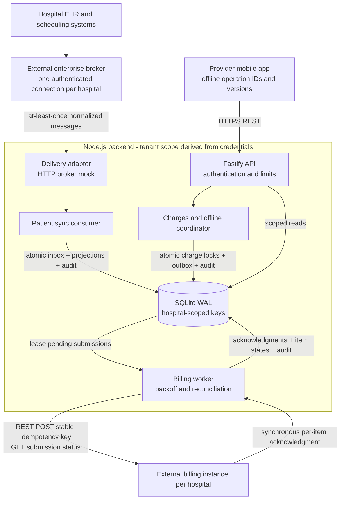
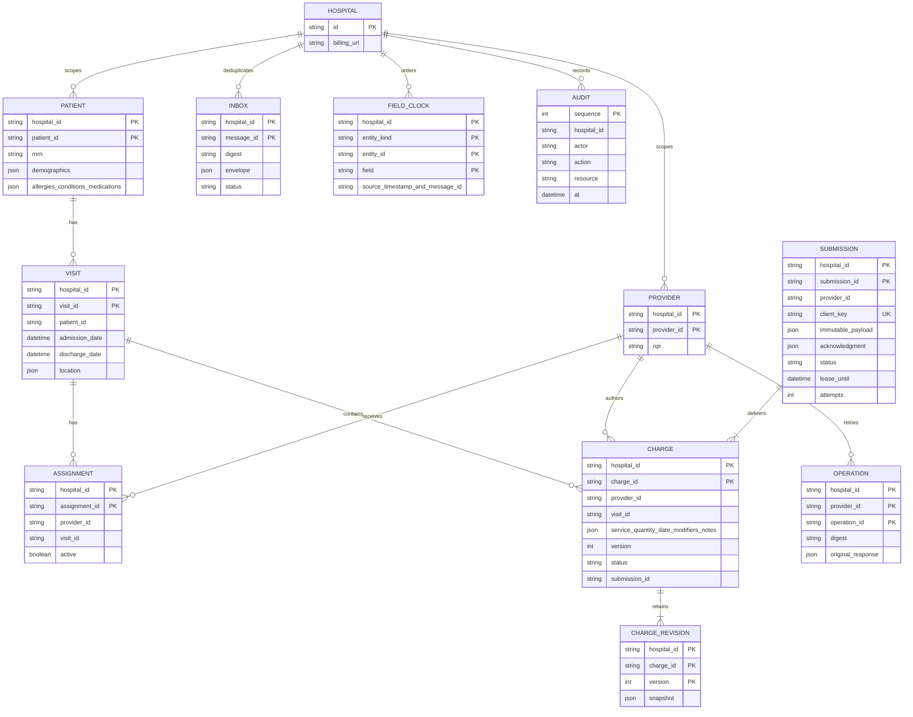

# Architecture and decisions

## System boundaries

The application is a modular monolith with a separately running delivery worker. Patient and charge transactions share one database; external billing calls never hold database locks. This avoids a distributed transaction while allowing the API to keep accepting work during billing outages.

For the demonstration, `scripts/demo.ts` replaces the broker and `src/mock-billing.ts` replaces billing. Both use the actual HTTP boundaries. The billing mock has its own persistent database and failure controls.

## Module organization

`api.ts` owns transport/security; it delegates business decisions to `patients.ts` and `charges.ts`. `contracts.ts` defines validated mobile input and common error semantics. `billing.ts` has an injectable transport, separating retry state transitions from HTTP. `db.ts` owns transactions/schema. `config.ts`, process entrypoints, and `seed.ts` are composition infrastructure.

These boundaries keep the take-home small while enabling extraction: patient consumption can move to a broker process, and billing workers already run separately. There is no repository interface per table or internal message bus: neither is needed to understand the current transactions. SQL is parameterized and tenant scope is explicit at every business read/write boundary.

## Data model

This diagram shows the logical model. Physically, source-owned patient/provider/visit/assignment projections share `entities(hospital, kind, id, body)`. Validated JSON preserves changing external clinical fields without a large EHR schema. Application transactions check cross-entity links; hospital references and composite identities are enforced by SQLite. A larger production implementation should normalize frequently queried relationships and add composite foreign keys and indexes. Submission ownership is unique on **(hospital, provider, mobile key)**, not the single-column shorthand in the diagram. Draft charges do not yet have a submission; corrected rejected charges point to a newer submission while immutable revisions retain prior links.

Clinical notes belong to each charge and are versioned with it. Every charge insert/update creates an immutable `charge_revisions` snapshot using database triggers. The audit table records actor/action/resource/time for changes and PHI reads; source inbox messages retain event history. Billing payloads and acknowledgments retain the reference and item outcomes. No application logs contain clinical content. Audit and revision triggers block SQL UPDATE/DELETE through normal application access; they do not prevent a privileged database administrator from tampering. Production needs separate append-only archival storage and access controls.

## State and transaction invariants

1. Patient inbox receipt, projection changes, field clocks, and audit commit together. Unexpected errors roll back; acknowledgment happens only after the commit. Invalid version/payload records persist in quarantine without changing projections.
2. Saving a draft uses a stable operation ID plus a payload digest. Exact retries return the original save result. A changed payload under the same ID returns 409. Compare-and-swap versions reject stale edits; they never silently overwrite clinical notes.
3. Submitting charges validates all rows, persists an immutable billing request, locks all charge rows, and audits them in a single transaction. No external call happens before commit. The submission row doubles as the durable outbox.
4. Mobile retry keys are permanent local receipts. Billing keys are server-generated submission UUIDs, scoped by hospital at the receiver. Transport retries reuse that key; a corrected rejected item uses a new logical submission.
5. Workers atomically claim due jobs with a 60-second lease and random fencing token. Only the current token may commit a result. Network calls have a five-second timeout. If a worker crashes, another reclaims and reconciles the same immutable request. Billing idempotency, rather than the lease alone, prevents duplicate external effects.
6. A terminal acknowledgment must account for every requested charge exactly once, match the submission ID and aggregate status, and supply a billing reference for accepted items. Otherwise it is uncertain and retried/reconciled. Partial acceptance is one atomic local update.

## Technology rationale and scalability

Node.js/TypeScript fits the requested stack, with Fastify for HTTP and Zod for runtime contracts. Node 22's built-in SQLite removes native add-on installation and makes a single-machine demonstration portable. WAL permits concurrent readers, while `BEGIN IMMEDIATE` serializes write decisions before checking keys/versions. See the [Node SQLite API](https://nodejs.org/download/release/latest-jod/docs/api/sqlite.html) and [SQLite transaction documentation](https://www.sqlite.org/lang_transaction.html).

SQLite writes and `DatabaseSync` calls block their process. This is a deliberate single-host trade-off, not a horizontally scalable storage claim. Short transactions, 1 MiB request limits, batches of at most 100, 120 requests/minute per configured token, and pagination bound the demo's work. Two independent tenants are seeded with identical external entity IDs to exercise isolation.

At larger scale, move to PostgreSQL: normalize relationships, enforce row-level security, use row-level compare-and-swap/unique constraints and `FOR UPDATE SKIP LOCKED` for workers, and add indexed sync cursors. Replace per-process rate limits with shared quotas, partition broker consumption by hospital/patient, add fair per-hospital worker scheduling/circuit breakers, central metrics, and managed secrets. No distributed queue is needed for billing until the database outbox becomes a measured bottleneck.

## Security assumptions

Demo bearer credentials model authenticated hospital membership; a provider cannot select another hospital in the request. Roles separate source writes, provider charge actions, and operational audit access. Providers see assigned patient lists and may access previously assigned visits to finish post-discharge billing. Historical access is deliberate; a real hospital may require a narrower time-limited entitlement policy.

For deployment beyond synthetic data: terminate TLS, authenticate brokers with per-hospital mTLS/OAuth, replace static tokens with short-lived identity tokens, encrypt database files/backups, use separate runtime/migration roles, define legal retention and access-review policies, and protect the mock from public exposure. TLS and storage encryption are deployment responsibilities not implemented by this local app. PHI exists in the database, revision history, inbox and outbox. This architecture alone does not establish regulatory compliance.
