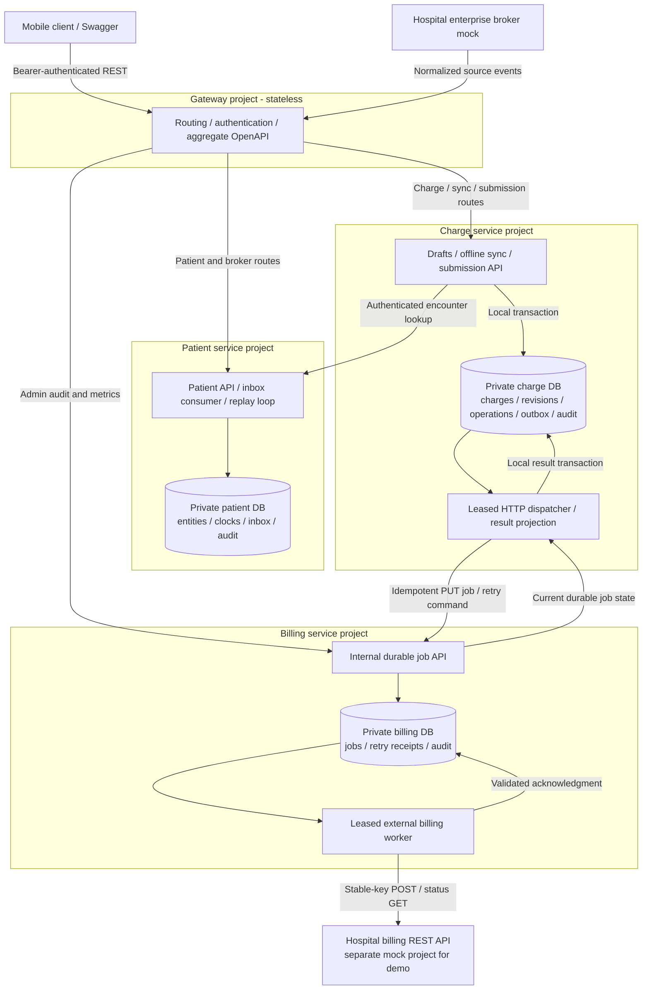
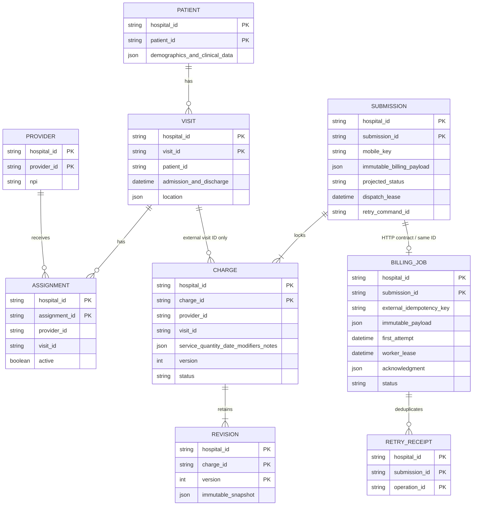

# Microservice architecture

The backend is split by business ownership into independently deployed Gateway, Patient, Charge, and Billing services, with a separate external Billing mock. They use private databases, versioned HTTP contracts, and durable handoff records. Deploying one domain service does not require restarting the others.

## Service diagram

No service mounts another service's volume or queries its tables. Shared `packages/contracts` contains wire types, runtime validators and demo example data. `packages/platform` contains generic SQL transaction, HTTP authentication/error and process-lifecycle helpers. It has no patient or charge tables. Each service declares its dependencies and builds to its own `dist/`; runtime images contain that project's domain code and the shared packages, not other services' domain code.

## Data ownership and logical ER model

Patient entities, visits, providers and assignments are validated JSON projections in Patient's `entities` table. Patient also owns `inbox` and `field_clocks`. Charge owns `operations`, `charges`, `charge_revisions`, and `submissions` (its outbox and local result projection). Billing owns a separate `submissions` table (durable external jobs) and `retry_receipts`. Same table names in separate databases do not imply shared state. Cross-service ER links are external identifiers, never cross-database foreign keys. Every domain record is scoped by hospital.

Each service stores its own hospital configuration and append-only audit. Billing alone uses its hospital billing URL to contact external systems. Charge stores only the encounter/billing fields needed in the immutable request; it does not replicate patient clinical records. Audit/revision triggers prevent ordinary UPDATE/DELETE, but privileged database administrators still require independent oversight and archival controls.

## Transaction and failure boundaries

### Patient ingestion

Envelope identity, projections, clocks and audit commit in Patient's transaction. Schema failures quarantine without modifying clinical state. Dependency gaps wait durably; an independent Patient replay loop revisits them. Timestamp/field ordering and unassignment tombstones preserve the prior behavior. Strict global source order still requires a broker sequence/watermark contract.

### Charge validation and offline edits

Charge authenticates the provider locally and requests a minimal encounter context from `POST /internal/v1/encounters/resolve`. Patient validates current/historical assignment and returns hospital/provider/visit IDs, MRN/NPI and stay dates. Charge verifies the response identity and service dates, then performs its own version/key checks and transaction. No network call holds a database lock.

This is point-in-time validation, not a distributed serializable transaction. A discharge/assignment change can arrive immediately after the lookup. New submissions re-resolve the encounter; already queued immutable requests are not rewritten. Historical assignments are intentionally allowed for post-discharge billing. A stricter hospital policy would need source version tokens/reservations or a compensation workflow. Patient outages fail new edits safely; known operation and submission receipts are returned without a new lookup.

### Charge-to-Billing handoff

Charge atomically locks the selected drafts, increments versions, stores the immutable payload and mobile receipt, and audits the action. A separate loop leases its own outbox row for 30 seconds and PUTs the same job to Billing. Billing validates the versioned contract and stores it before replying. Identical repeated requests return current state; changed payloads under the same job ID conflict. A timeout after commit leaves the outbox eligible for the same-key retry.

Billing runs its own 60-second leased external worker. It can finish while Charge is down. The Charge dispatcher continues retrieving current state through idempotent PUT responses, validates IDs/digest/item acknowledgment, and atomically updates local item states. Fencing tokens prevent stale dispatchers overwriting newer results. This is eventual consistency: mobile clients may briefly see QUEUED after Billing has committed ACCEPTED. They must poll the returned submission ID.

Manual retry is another durable command with its own operation ID. Billing receipts deduplicate that command without resetting a live worker lease, billing key, original payload, attempt count, or first-attempt timestamp. The local command is removed only after its response is processed; a lost response safely replays the command.

### External billing uncertainty

The original external contract still grants only 24 hours of deduplication. Billing uses the same external key for transport retries, queries prior status first, and stops blind POSTs after 23 hours. A complete valid acknowledgment can finalize after expiry; a 404 or summary-only response cannot justify another POST then. Items stay locked in REVIEW until authoritative reconciliation is possible. Partial acceptance updates only corresponding items; a new batch contains only corrected rejected drafts. Neither service restarts, handoff retries nor migration resets the time window.

## Deployment, authentication and scaling

Gateway exposes port 3002 and Swagger; only the mock additionally exposes port 4001 for demo controls. Patient, Charge and Billing have private Docker-network ports and distinct named volumes. All services independently validate external bearer credentials. Internal Patient and Billing APIs require distinct service tokens; Gateway has no internal API route. In production replace demo static tokens with workload identity/mTLS and short-lived user tokens, encrypt PHI storage/backups and terminate TLS.

Separate projects allow independent deployment/storage migrations, ownership and failure isolation. They introduce network latency, partial failure, eventual consistency, service authentication, multiple audit cursors and operational overhead. This split is intentionally requested; the previous monolith had lower operational cost for the original scope.

Each service still uses synchronous SQLite with WAL and short write transactions. These are independent single-host stores, not a multi-host clustered database. Horizontal service replicas need PostgreSQL (per service or separately permissioned databases) with row locking/unique constraints. HTTP outbox polling is sufficient for this demo; a broker can later carry the same versioned job/result contracts without changing durable identity rules. Add backpressure, shared rate limits, queue-age alerts, per-hospital scheduling, tracing and circuit breakers as measured load requires.
