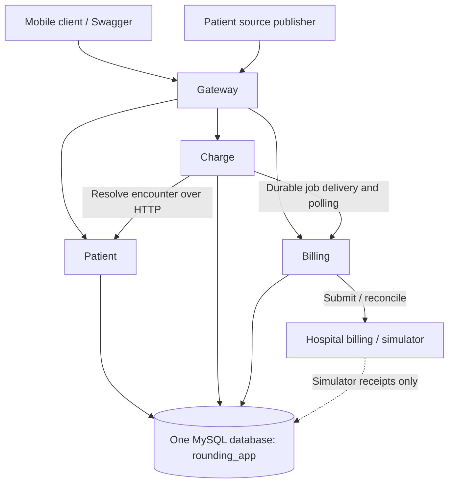

# Architecture

Gateway, Patient, Charge, Billing, and the external billing simulator are separate NestJS applications. Patient, Charge, Billing, and the simulator connect to **one MySQL database** using asynchronous connection pools. Table ownership is a code-level boundary; the database is shared infrastructure and a common availability dependency.

## Code organization

```text
services/patient-service/src/
  main.ts                       # Configuration, MySQL connection, process lifecycle
  app.ts                        # Async Nest application factory
  store.ts                      # MySQL adapter and patient query helper; no DDL
  patient/
    patient.module.ts           # Nest providers and dependency injection
    patient.controller.ts       # HTTP routes, validation, roles, responses
    patient.service.ts          # Application queries and workflows
    patient-events.ts           # Event processing, clocks, deduplication, replay

database/
  schema.sql                    # Standalone MySQL schema, indexes, and triggers
  README.md                     # Explicit provisioning and connection instructions
```

Other applications follow the same feature layout. Nest uses the standard Express adapter. Modules use `@Module`, controllers use `@Controller` and route decorators, and services use `@Injectable`. Factory providers inject stores and external clients into each application container. The shared `PlatformModule` supplies authentication guards, exception filters, and infrastructure endpoints. `@nestjs/swagger` serves the aggregate public contract.

Controllers contain no SQL. Services and domain helpers await database operations. The database adapter binds parameters and uses `AsyncLocalStorage` to keep each transaction's queries on its reserved pool connection. No application constructor or startup hook creates tables, migrates data, or inserts demo records. Schema administration is separate from process startup.

## Services and shared storage



| Owner                | Tables                                                                   |
| -------------------- | ------------------------------------------------------------------------ |
| Shared configuration | `hospitals`                                                              |
| Shared audit storage | `audit`, filtered by `service` and `hospital`                            |
| Patient              | `patient_entities`, `patient_field_clocks`, `patient_inbox`              |
| Charge               | `charges`, `charge_revisions`, `charge_operations`, `charge_submissions` |
| Billing              | `billing_submissions`, `billing_retry_receipts`                          |
| Optional simulator   | `mock_modes`, `mock_results`                                             |

All domain identifiers are scoped by hospital. JSON columns preserve validated wire payloads and clinical projections. The `mysql2` driver returns JSON columns as strings for explicit parsing. InnoDB indexes cover tenant keys, client receipts, replay, and worker scheduling. Application accounts can read/write data but need no schema privileges. The SQL script defines append-only audit/revision triggers and charge revision capture.

## Transaction and concurrency rules

- A transaction uses one pooled connection until commit or rollback. Unrelated asynchronous requests use their own connections.
- Patient ingestion, draft saves, submissions, retry commands, and simulator receipt creation lock the hospital row before read/check/write sequences. This protects missing-row idempotency checks across processes. Transactions use READ COMMITTED isolation and bounded retries for deadlocks/lock timeouts.
- Worker and dispatcher claims use `FOR UPDATE SKIP LOCKED`, then persist lease tokens before releasing their transactions. Result updates lock their submission row and verify the lease token. Expired workers cannot overwrite newer work.
- Database transactions contain no HTTP calls. Encounter lookup, billing delivery, and external reconciliation happen outside locks.
- Hospital-level serialization is deliberately simple and can constrain a busy hospital's write throughput. Move to finer-grained locking only while preserving duplicate receipt and version-conflict invariants.

## Patient ingestion

The source system remains authoritative. The integration endpoint authenticates a hospital-scoped integration principal, validates the event envelope, and deduplicates by hospital/message ID and payload digest. Per-field timestamp/message-ID clocks make independent late updates deterministic. Unassignment tombstones prevent late assignments from restoring access.

Processing uses a savepoint inside the inbox transaction. Missing dependencies become WAITING; unsupported schemas and invalid relationships become QUARANTINED. Partial projection writes roll back to the savepoint. Successful upstream events trigger bounded replay; the background loop also replays waiting events. Repeated delivery returns the stored outcome. Infrastructure failure rolls back the whole transaction for safe redelivery.

## Charge and billing flow

Saving drafts uses stable operation IDs, stored responses, and expected versions. A committed retry returns its receipt even if Patient service is down. New edits resolve encounter authorization through Patient before opening the write transaction. Sync processes operations sequentially and returns HTTP 207 with individual outcomes.

Submission atomically locks draft charges and writes an immutable request to `charge_submissions`. Its dispatcher sends the same submission ID to Billing, which commits `billing_submissions` before acknowledging. Lost HTTP responses safely replay that ID. Charge polls and projects validated item acknowledgments into charges and revisions. The database is shared, but this workflow still uses durable HTTP handoff and eventual consistency.

Billing retries preserve the original external key, payload, and first-attempt time. A repeated attempt queries the external system before replay. Blind POSTs stop after 23 hours because the external deduplication contract lasts 24 hours. Uncertain results remain in REVIEW. Partial acceptance only allows corrected rejected items into a new submission. Manual retries never reset the original clock.

## Configuration and lifecycle

Connection settings are `DB_HOST`, `DB_PORT`, `DB_NAME`, `DB_USER`, `DB_PASSWORD`, and `DB_POOL_SIZE`. All database-using applications target the same database. Credentials are supplied through environment variables or root `.env`; no local database paths are used. Hospital billing URLs are explicit records in `hospitals`.

Nest's `onModuleDestroy` drains background tasks. HTTP shutdown finishes before `onApplicationShutdown` closes the connection pool. Health checks query MySQL; they do not initialize it. Gateway remains stateless. Docker uses one MySQL volume and no application database-file volumes.

Separate processes can deploy independently, but shared schema changes require coordination. Configure backups, restore drills, database capacity, pool limits, tenant-aware metrics, and authentication for the intended deployment. The per-process HTTP rate limiter is not a cluster-wide quota.
