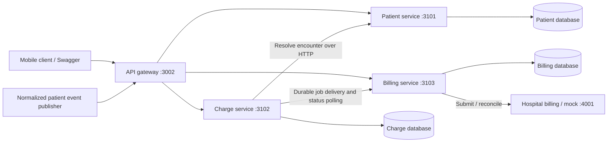
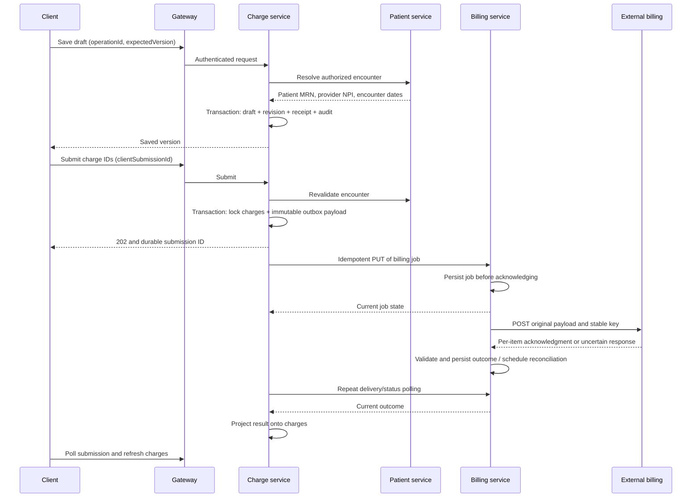

# Project interview guide

This guide describes the implemented Node.js application. Suggested spoken answers are rehearsal material: adapt them to your understanding and contribution. Production improvements are explicitly distinguished from features already built.

## 1. Start with this 90-second explanation

> This is a backend for hospital rounding and charge capture. Providers can view assigned patients, save charge drafts, synchronize edits made offline, and submit charges to an external hospital billing system.
>
> The main challenge is reliability across system boundaries. Patient events can arrive more than once or out of order. Mobile clients can repeat operations or submit conflicting edits. Billing can accept a charge and lose the response, and its idempotency protection lasts only 24 hours.
>
> I organized the application into a gateway, Patient service, Charge service, and Billing service. There is also a separate billing simulator for testing. Each domain service owns its database and communicates through authenticated HTTP contracts.
>
> The design uses durable inbox and outbox records, idempotency receipts, optimistic version checks, immutable billing payloads, and background workers. Billing retries preserve the same key and payload. For an uncertain outcome, the worker queries billing before resending. It stops automatic resubmission after a conservative 23-hour window and leaves the submission for reconciliation rather than creating another possible charge.
>
> I validated normal flows and failures using automated tests, real HTTP between services, persistent Docker volumes, and a repeatable demonstration. The implementation is suitable for demonstrating the design; production would require stronger identity, storage, security, and operational infrastructure.

## 2. Explain the requirements before the technology

| Requirement                                | Design response                                                                                      |
| ------------------------------------------ | ---------------------------------------------------------------------------------------------------- |
| Patient source remains authoritative       | Patient service consumes normalized source events; mobile clients cannot change patient source data. |
| Duplicate event delivery                   | Persistent inbox keyed by hospital and message ID, with a payload digest.                            |
| Late events and missing dependencies       | Per-field ordering clocks, assignment tombstones, and a waiting inbox replay process.                |
| Offline mobile edits                       | Stable operation IDs, saved responses, and optimistic charge versions.                               |
| Drafts must not become bills automatically | Explicit submission step; saving a draft never calls billing.                                        |
| Billing outages and lost responses         | Durable jobs, bounded retries, lookup before replay, and a review state.                             |
| Partial acceptance                         | Validate and apply outcomes per charge; correct and resubmit only rejected items.                    |
| Multiple hospitals                         | Hospital identity from credentials; tenant-scoped records and authorization checks.                  |
| Traceability                               | Charge revisions and service-owned audit records.                                                    |
| Runnable assignment                        | Docker Compose, Swagger, synthetic seed data, mock billing, tests, and demo script.                  |

Define the invariants you protected:

1. A repeated logical operation cannot silently become a different operation.
2. A queued or accepted charge cannot be edited into a different bill.
3. Retrying an uncertain billing submission never generates a new billing key.
4. Accepted items are not included in the correction batch for rejected items.
5. No service reads or writes another domain service's database.
6. One hospital cannot access another hospital's records by guessing identifiers.
7. A successful queue response means work is durably stored, not that billing accepted it.

## 3. Architecture and service boundaries



| Project         | Responsibility                                                                   | Why it is separate                                                                                            |
| --------------- | -------------------------------------------------------------------------------- | ------------------------------------------------------------------------------------------------------------- |
| Gateway         | Public routing, authentication, aggregate Swagger                                | Provides a stable client endpoint while services change independently.                                        |
| Patient service | Patients, providers, visits, assignments, source-event inbox                     | Owns authoritative-source integration and encounter authorization.                                            |
| Charge service  | Drafts, edit receipts, versions, revisions, submission outbox, projected results | Owns the provider's charge lifecycle and offline behavior.                                                    |
| Billing service | Durable billing jobs, external submission, retry age, reconciliation             | Isolates unreliable external billing and owns the retry safety policy.                                        |
| Billing mock    | External receipts and controllable failures                                      | Makes difficult billing failure scenarios reproducible. It is a simulator, not a production business service. |

There are four application services plus one simulator. Each has its own package, TypeScript configuration, Dockerfile, and entrypoint. They are independent projects in one npm-workspace monorepo, not separate Git repositories.

Shared packages contain wire contracts and generic infrastructure. They do not contain shared domain repositories. Independent deployment still requires backward-compatible contracts and coordinated shared-package version management.

**Why microservices?** The original implementation was a monolith and was split following the requested architectural change. The boundaries follow data ownership and failure responsibilities. This allows billing to restart or evolve separately from patient ingestion. It also adds network failures, eventual consistency, deployment work, and harder debugging. For a small team and this assignment's initial scope, a modular monolith would remain a reasonable alternative.

**Why HTTP rather than a message broker?** Durable database records provide retryable delivery without introducing a broker into the demo. Delivery is at least once, and receivers deduplicate. A production broker could improve distribution and throughput, but it would not remove the need for durable receipts, idempotency, and external reconciliation.

## 4. Technology choices and their limits

| Choice                                           | Explanation                                                                                            | Trade-off                                                                                             |
| ------------------------------------------------ | ------------------------------------------------------------------------------------------------------ | ----------------------------------------------------------------------------------------------------- |
| Node.js and TypeScript                           | Fits asynchronous HTTP integration; types clarify service contracts.                                   | TypeScript does not validate network input at runtime.                                                |
| NestJS with Express                              | Decorated modules/controllers, dependency injection, guards, lifecycle hooks, and Swagger integration. | Business rules remain in injectable services and domain helpers.                                      |
| Zod                                              | Runtime validation of client input and service contracts.                                              | Schema validation alone cannot prove business authorization or billing correctness.                   |
| SQLite per domain service                        | Simple persistent transactions, unique constraints, and portable local setup.                          | Synchronous access and single-writer limits make this unsuitable for unrestricted horizontal scaling. |
| WAL, full synchronous writes, local transactions | Protect committed local state and make recovery practical.                                             | They do not make transactions atomic across services or external billing.                             |
| Docker Compose and named volumes                 | Reproducible startup, isolated services, persistent demo state.                                        | Compose is not a production high-availability platform.                                               |
| Node test runner and real HTTP integration tests | Exercises state transitions and service boundaries.                                                    | This is not a load, penetration, or production chaos-testing program.                                 |

Production storage could move to PostgreSQL per service, with appropriate locking, indexes, backups, and tenant controls. That migration is a proposal, not something already implemented.

## 5. End-to-end flow to draw on a whiteboard



There is no distributed database transaction. Each step commits locally. The Charge service can briefly show `QUEUED` after Billing has accepted the job; its result projection is eventually consistent.

Encounter validation is a point-in-time HTTP check. Patient state can change after the lookup. This is an explicit consistency limitation, not a globally locked encounter snapshot.

## 6. Patient event ingestion

The implemented event types are `PATIENT_ASSIGNMENT`, `PATIENT_UNASSIGNMENT`, `PATIENT_UPDATE`, `VISIT_ADMISSION`, `VISIT_LOCATION_CHANGE`, and `VISIT_DISCHARGE`.

Processing steps:

1. Authenticate the integration principal and derive its hospital.
2. Validate the envelope and supported payload schema.
3. Look up `(hospital, messageId)` in the persistent inbox.
4. Return the saved result for identical redelivery; reject reuse with different content.
5. Apply projections, field clocks, inbox outcome, and audit changes transactionally.
6. Keep events with missing dependencies in `WAITING`; retry them as dependencies arrive and during background replay.
7. Quarantine unsupported types, versions, or invalid supported payloads for inspection.

Per-field clocks use normalized event timestamps with message ID as a deterministic tie-breaker. An older phone-number update cannot overwrite a newer phone number, while an independent field may still be applied. Nested objects and arrays are replaced as whole fields. Unassignment tombstones prevent an older assignment from reviving access.

**Important distinction:** this converges projections using ordering rules; it does not execute every event in a literal globally ordered stream. Strict ordering would require a stronger source contract such as per-aggregate sequence numbers and partitioning.

Malformed envelopes rejected before inbox persistence need dead-letter handling in a real broker adapter. The runnable source publisher uses authenticated HTTP; a production AMQP/Kafka consumer is not implemented.

## 7. Offline edits and concurrency

An edit request carries `chargeId`, `operationId`, `expectedVersion`, and the new charge content.

| Identifier                                 | Meaning                                         | Retry rule                                                |
| ------------------------------------------ | ----------------------------------------------- | --------------------------------------------------------- |
| Source `messageId`                         | One source event within a hospital              | Same ID must retain the same content.                     |
| `chargeId`                                 | One logical charge                              | Retain it across edits and retries.                       |
| `operationId`                              | One provider edit within a hospital             | Retry the exact edit with the same ID.                    |
| `expectedVersion`                          | Version the provider edited                     | A new edit must use the current version.                  |
| Mobile `clientSubmissionId`                | One client batch within hospital/provider scope | Retain it and the same charge set for submission retries. |
| Server submission ID / external client key | One immutable external billing submission       | Never change it to escape an uncertain outcome.           |

Example conflict:

- Devices A and B both read version 1.
- A saves with expected version 1 and receives version 2.
- B saves a different edit with expected version 1 and gets `409 VERSION_CONFLICT` with the authorized current record.
- The user resolves the conflict and submits a new operation ID against version 2.

Clinical notes are not automatically merged because silent merging can change their meaning.

If A loses the response, repeating its original operation returns its original receipt. It does not perform the edit again, even if the current charge has since advanced. A receipt is evidence of that operation; fetch the charge to obtain its current state.

`POST /v1/sync` accepts up to 100 operations. Valid batches return HTTP 207 with independent outcomes. It is not one all-or-nothing transaction. If infrastructure fails midway, replaying the same operation IDs safely recovers earlier committed operations.

Idempotency cannot detect a client inventing a new charge ID for the same real-world service. Stable client identity is part of the contract; semantic duplicate detection would be a separate feature.

## 8. Submission, outbox, and inter-service delivery

Submission checks provider ownership, draft state, one visit per batch, and dates within the encounter. Prices are not accepted from the client. Service-code validation checks format, not a licensed clinical code catalog.

The Charge service commits these together:

- Immutable external request with patient/provider billing identifiers.
- Durable submission/outbox record.
- Transition of the submitted charges to `QUEUED`, with new revisions.
- Submission receipt and audit information.

This closes the gap where a charge could be marked queued but no durable work exists. The API returns 202 after this transaction; the external call runs later.

The dispatcher delivers through an idempotent internal PUT. Billing persists the job before responding and compares payload digests on duplicates. If the response is lost, delivering again returns the same job. If Billing is down, the outbox remains and charges stay locked.

The current dispatcher also obtains status by repeating this idempotent call. It uses approximately one-second polling for active work and a two-second delay after handoff errors. This is different from the exponential backoff used for external billing failures.

## 9. The critical 24-hour idempotency answer

> A timeout means I do not know the outcome. It does not mean the charge failed. Therefore I preserve the original billing key and payload, query for the original submission, and replay only while the external deduplication window is still safe. Once that window is exhausted, I stop automatic POSTs and require evidence-based reconciliation.

The first external worker claim records `first_attempt` durably, conservatively before sending. It is not reset by restart, manual retry, migration, or inter-service redelivery. Time spent waiting in the Charge outbox before the first external attempt does not consume the external retry window.

On a later worker attempt:

1. Query billing using the existing submission identifier.
2. If a complete, valid per-item receipt is available, apply it without another POST. This can resolve the outcome even after expiry.
3. A summary-only response or 404 does not establish every item outcome and does not prove the original POST failed.
4. Before 23 hours have elapsed, the worker may replay the identical POST with the identical key.
5. At or beyond 23 hours, it moves to `REVIEW` with `IDEMPOTENCY_WINDOW_EXPIRED` and does not POST.
6. If lookup itself is unavailable, schedule another reconciliation attempt, subject to the attempt ceiling.

Example: first attempt Monday 10:00, billing commits, response is lost. A complete lookup receipt resolves the job. Otherwise identical replay is permitted within the conservative window. From Tuesday 09:00 onward, uncertainty cannot trigger a POST. A Tuesday 11:00 full receipt can still safely finalize the job.

Manual retry uses the existing job and key. It does not create a fresh window. After expiry, it can recheck billing; without complete evidence, the job remains unresolved. An operator should reconcile against billing records rather than create a replacement key based only on a timeout or 404. There is no implemented operator screen or general manual-outcome override API.

**Do not claim unconditional exactly-once billing.** The guarantee depends on the external system atomically deduplicating concurrent same-key submissions and retaining receipts for its stated window. A local database cannot guarantee both eventual billing and no duplicates after the remote system forgets the key. The design favors duplicate-charge prevention over automatic completion when evidence is insufficient. The one-hour margin is conservative; it is not proof against unbounded request delays, arbitrary clock rollback, or a broken external contract.

## 10. Retry, acknowledgment, and partial acceptance

| Situation                                 | Implemented behavior                                                                                                                |
| ----------------------------------------- | ----------------------------------------------------------------------------------------------------------------------------------- |
| Network error, timeout, HTTP 429 or 5xx   | Keep uncertainty, schedule retry, reconcile before another submission.                                                              |
| `Retry-After` supplied                    | Honor it as a minimum delay.                                                                                                        |
| Repeated transient failure                | Exponential delay starting around 1 second, capped at 30 seconds, plus up to 499 ms jitter.                                         |
| Ten unsuccessful worker attempts          | Park in `REVIEW`; attempts include reconciliation rounds, not just POST calls.                                                      |
| HTTP 400                                  | Treat as definitive validation failure under the billing contract; mark submission `FAILED` and project rejection onto its charges. |
| Other configuration/protocol 4xx          | Move to review.                                                                                                                     |
| HTTP 200 with invalid item acknowledgment | Do not guess success; retry/reconcile with charges held.                                                                            |
| Idempotency window expired                | No automatic POST; review or resolve from a full receipt.                                                                           |

Acknowledgment validation requires matching submission identity, no unknown or duplicated item IDs, every submitted item accounted for, consistent aggregate status, and a billing reference where required for acceptance.

For a batch with A accepted and B rejected, A stays accepted and immutable. The provider fetches B's current version, corrects it using a new edit operation, and submits only B under a new mobile batch key. This is a new corrected billing request after definitive rejection, not a replay of an uncertain charge.

Do not describe a circuit breaker as implemented; the current mechanisms are bounded retries, delays, leases, and review states.

## 11. Crashes, leases, and fencing

| Mechanism                                | Problem it solves                                                                      |
| ---------------------------------------- | -------------------------------------------------------------------------------------- |
| Local database transaction               | Keeps related local state changes atomic.                                              |
| Optimistic version                       | Prevents stale provider edits overwriting current data.                                |
| Unique receipt key and payload digest    | Prevents replay becoming another operation or altered operation.                       |
| Durable inbox/outbox                     | Preserves accepted work across process failure.                                        |
| Expiring worker lease                    | Allows another worker to recover abandoned work.                                       |
| Random lease token checked on completion | Prevents a stale worker committing local results after another worker takes ownership. |
| External idempotency key                 | Protects remote side effects when requests can repeat.                                 |

Charge dispatch leases last 30 seconds; billing leases last 60 seconds; the billing HTTP timeout is 5 seconds. Network calls run outside database transactions.

Fencing protects local writes. It does not cancel a remote request already in flight. External idempotency is still necessary if a paused worker resumes after its lease expires.

Graceful shutdown drains background work in Nest's `onModuleDestroy` hook and closes the database in `onApplicationShutdown`, after the HTTP server closes. A lifecycle test covers this ordering. A forced crash still relies on durable state and lease recovery.

## 12. Security, privacy, and audit

Implemented controls:

- Hospital and provider identity come from credentials; users cannot select arbitrary tenants through request content.
- Domain services revalidate authentication as well as the gateway.
- Internal encounter and job endpoints use service credentials and are not publicly routed through the gateway.
- Charge ownership and encounter assignment are checked, including historical assignments for eligible post-discharge work.
- Bounded request bodies, batch sizes, pagination, and a process-local rate limiter constrain abuse.
- Request IDs and safe error codes support diagnosis without logging clinical request bodies.
- Responses use `no-store`; charge revisions and audit records support investigation.
- SQL triggers prevent normal updates/deletes to protected history rows.

Be explicit about limits: local demo authentication uses configured bearer tokens, not OAuth/OIDC. Database files and durable payloads contain sensitive information; avoiding PHI in logs does not encrypt storage. Production TLS, managed secrets, encryption at rest, retention rules, access reviews, and stronger identity remain work. Audit triggers do not protect against a privileged administrator; externally protected audit storage would be stronger. Do not claim regulatory certification.

Historical assignment access is not currently time-limited. Production authorization policy must define who may access discharged encounters and for how long.

## 13. How to explain the development sequence

Describe the reasoning in this order; avoid presenting this as an invented commit-by-commit history:

1. Extract actors, source-of-truth boundaries, workflows, and external billing constraints from the assignment.
2. Write invariants and failure scenarios before choosing retry behavior.
3. Define validated event, charge, submission, and acknowledgment contracts.
4. Implement persistent stores, transaction boundaries, tenant keys, revisions, and audit.
5. Implement patient ingestion with duplicate detection, ordering, dependency replay, and quarantine.
6. Implement draft saves and offline synchronization with receipts and version conflicts.
7. Implement durable submission and immutable billing payloads.
8. Implement external reconciliation, same-key replay, acknowledgment validation, and expiry review.
9. Provide a billing simulator for outages, rate limits, rejection, and lost acknowledgments.
10. Split domain ownership into the requested microservice projects and replace local cross-domain calls with authenticated HTTP.
11. Migrate existing state without losing receipts, submission identities, or first-attempt timestamps.
12. Package services for Docker and demonstrate both successful workflows and failures.

The migration used a maintenance cutover: stop old writers, copy the old SQLite database and WAL into a temporary working area, import into private service stores, and record migration receipts so reruns are safe. The old volume is retained. It is not an online dual-write migration; reverting after new writes requires another data migration.

## 14. Interview demo: 10–15 minutes

Before the interview, use synthetic data and verify the stack. If Docker is already running the app, do not also run `npm run demo:start` on the same ports.

```powershell
docker compose ps
# If the application needs to be started or rebuilt:
docker compose up --build -d --wait
```

Open **http://localhost:3002/docs/**. In Authorize enter `demo-provider-one` without a `Bearer` prefix. OpenAPI JSON is at **http://localhost:3002/docs/json**.

Suggested walkthrough:

1. Show the service diagram and private data ownership.
2. Call `GET /v1/me`, then `GET /v1/patients` and a returned visit.
3. Save a draft through `POST /v1/charges`; use a fresh charge ID and operation ID, expected version 0, and a service date inside that visit.
4. Repeat the exact request: explain the returned operation receipt.
5. Try a new edit with a stale expected version: explain HTTP 409 and user conflict resolution.
6. Submit using `POST /v1/submissions`; explain why 202 means durably queued.
7. Poll `GET /v1/submissions/:id`, then refresh the charges.
8. Demonstrate failures using the automated demo and explain the relevant state transitions.
9. Switch to `demo-admin-one` for audit and metrics. Audit selection uses `service=patient`, `charge`, or `billing`, with independent cursors.

The repeatable automated workflow uses new identifiers on each run:

```powershell
# If host dependencies/shared package output are not available:
npm ci
npm run build:shared

npm run demo
```

It exercises event duplicates, offline conflicts, submission duplicates, outage recovery, partial acceptance, rejected-item correction, lost acknowledgment, tenant isolation, and audit access. It writes synthetic demo records.

For a controlled failure, the mock exposes a separate authenticated control endpoint:

```powershell
$mockHeaders = @{ Authorization = 'Bearer demo-billing-secret' }
$mockBody = @{ hospitalId = 'HOSP-001'; mode = 'lost-ack'; remaining = 1 } | ConvertTo-Json
Invoke-RestMethod -Method Post -Uri 'http://localhost:4001/admin/mode' -Headers $mockHeaders -ContentType 'application/json' -Body $mockBody
```

Then submit a new batch. `lost-ack` commits the mock receipt and returns 503, simulating an uncertain response; it is not a literal dropped TCP connection. Other modes are `outage`, `rate-limit`, and `healthy`. Service code `99999` or modifier `99` forces an item rejection.

Demonstrate the 23-hour boundary through the automated tests with a controlled clock; do not wait a day or mutate the running demo database. Swagger payload examples and exact endpoint contracts are in [API.md](API.md).

## 15. Testing evidence to discuss

The implementation was previously verified with 25 automated tests across patient ingestion, billing, microservices, migration, and shutdown lifecycle. Build/type checks, Docker startup, and the repeatable demo were also checked during implementation. This documentation update does not itself rerun those checks.

For fresh evidence before the interview:

```powershell
npm test
npm run typecheck
npm audit
```

Explain representative assertions, not just the count:

- Duplicate message produces no duplicate projection effect; changed content under its ID fails.
- Stale edits fail while identical edit retries return the saved receipt.
- A lost inter-service response results in one persistent billing job.
- Lost external acknowledgment is resolved without a new billing identity.
- Expired uncertain submissions do not perform another POST.
- Summary-only lookups replay only within the safe window.
- Stale lease owners cannot overwrite newer local worker state.
- Partial acceptance allows correction only of rejected items.
- Hospital isolation and service credentials are enforced.
- Migration preserves billing age and can resume safely.
- Background work drains before the database closes.

Do not invent throughput, latency, coverage percentages, production availability, or cost savings. Those require measurements that this project has not established.

## 16. Likely panel questions and answers

**Is this exactly-once processing?**
Delivery is at least once. Durable receipts make local operations idempotent. External duplicate prevention is conditional on the billing contract and its retention window; uncertain expired work is held for reconciliation.

**Why not generate a new key when a retry fails?**
The original call may have succeeded. A new key bypasses the external deduplication record and can create a second charge.

**Why not retry indefinitely with the same key?**
After 24 hours the external system may forget the key and treat it as new. The implementation stops POSTs at 23 hours.

**Does a 404 lookup make retry safe after expiry?**
No. It may mean the receipt expired or is unavailable. It is not proof that a charge never occurred.

**What if billing succeeds but the service crashes before saving the result?**
The original job, key, payload, and age remain durable. After lease recovery, the worker reconciles and, only within the window, can replay the same request.

**What if Charge crashes after locking the charges?**
The outbox was committed in the same transaction. Its dispatcher resumes durable delivery after restart.

**What if Billing accepts the job but its HTTP response is lost?**
Charge repeats the internal PUT. Billing recognizes the stored job and matching payload digest and returns its current state.

**Why both an operation ID and expected version?**
The operation ID recognizes an identical replay. The version prevents two different edits based on the same stale record from silently overwriting each other.

**What if two users submit the same charge concurrently?**
Local transactions validate its state while creating the outbox and locking it. After one queues the charge, a fresh conflicting submission fails. A retry of the original batch returns its existing receipt/state.

**Why not use a shared database for simplicity?**
It couples service schemas and deployment. Private stores keep domain ownership explicit, at the cost of HTTP calls, duplicated immutable snapshots, and eventual consistency.

**Can every service scale to many replicas now?**
No. The architecture separates processes, but SQLite and local volumes constrain multi-host scaling. A production database and worker-claim strategy are prerequisites; a diagram alone does not establish scalability.

**What happens when Patient service is unavailable?**
New work requiring encounter validation fails instead of bypassing authorization. An identical completed save can return its existing receipt without resolving the encounter again. Already persisted billing work can continue independently.

**How are old patient events handled?**
Field timestamps and deterministic ties prevent stale overwrites; missing dependencies wait for replay. This is not a claim of strict total-order event execution.

**Why not automatically merge offline notes?**
Conflicting clinical changes need deliberate review. The API returns the current authorized version so the client can support resolution.

**How do you know a partial receipt is safe to apply?**
Validate that accepted and rejected item IDs exactly cover the submitted set without overlaps, omissions, or unknown items, and check submission identity and aggregate status.

**Is this event sourcing, CQRS, or a saga?**
It uses durable inbox/outbox records, revisions, and a result projection. It does not implement a general event-sourced system, a CQRS framework, or a saga orchestration platform. There is no compensation that reverses an already accepted external charge.

**What would you improve first?**
Clarify the billing reconciliation contract, production identity and tenant policy, database durability/backup, and review operations. Then address scale, telemetry, retention, and automated operational recovery.

## 17. Production improvements, in priority order

1. Agree on external guarantees: atomic idempotency, retention semantics, complete item lookup, permanent business identifiers, and a documented operator reconciliation process.
2. Add managed identity/OIDC, secret rotation, TLS, storage encryption, and explicit post-discharge authorization policy.
3. Move storage to production-managed databases with backup/restore drills, tenant-aware indexes, safe concurrent job claiming, and schema migrations.
4. Add alerts for oldest queued job, uncertainty age approaching cutoff, review backlog, rejection rate, quarantined source events, and projection lag. Current admin counters are not a full observability platform.
5. Build a reconciliation workflow showing evidence and audited operator decisions, without unsafe new-key resubmission shortcuts.
6. Add hospital fairness, external concurrency limits, shared rate limiting, and capacity tests. Consider broker-backed transport if throughput or topology justifies it.
7. Define hospital business timezones, source ordering/sequence rules, receipt retention, PHI minimization, and archival policies. Current idempotency receipts have no automatic TTL.
8. Add contract compatibility checks, CI deployment controls, disaster recovery exercises, and load/security testing.

## 18. Code navigation for a panel

| Topic                                  | File                                                                                                         |
| -------------------------------------- | ------------------------------------------------------------------------------------------------------------ |
| Original requirements                  | [TAKE_HOME_ASSIGNMENT.md](../TAKE_HOME_ASSIGNMENT.md)                                                        |
| Component and data diagrams            | [ARCHITECTURE.md](ARCHITECTURE.md)                                                                           |
| Public gateway                         | [gateway/src/gateway/gateway.controller.ts](../services/gateway/src/gateway/gateway.controller.ts)           |
| Patient deduplication and projections  | [patient-service/src/patient/patient-events.ts](../services/patient-service/src/patient/patient-events.ts)   |
| Charge receipts, conflicts, submission | [charge-service/src/charge/charge-operations.ts](../services/charge-service/src/charge/charge-operations.ts) |
| Outbox delivery and result projection  | [charge-service/src/dispatcher.ts](../services/charge-service/src/dispatcher.ts)                             |
| Billing job ingestion                  | [billing-service/src/billing/billing-jobs.ts](../services/billing-service/src/billing/billing-jobs.ts)       |
| External retries and 23-hour cutoff    | [billing-service/src/worker.ts](../services/billing-service/src/worker.ts)                                   |
| Per-item acknowledgment validation     | [contracts/src/billing.ts](../packages/contracts/src/billing.ts)                                             |
| Service wire contracts                 | [contracts/src/internal.ts](../packages/contracts/src/internal.ts)                                           |
| Database transaction infrastructure    | [platform/src/db.ts](../packages/platform/src/db.ts)                                                         |
| Background lifecycle                   | [platform/src/runtime.ts](../packages/platform/src/runtime.ts)                                               |
| External failure simulator             | [billing-mock/src/mock/mock.service.ts](../services/billing-mock/src/mock/mock.service.ts)                   |
| Automated demonstration                | [scripts/demo.ts](../scripts/demo.ts)                                                                        |
| Deployment                             | [compose.yaml](../compose.yaml)                                                                              |
| Migration design                       | [MIGRATION.md](MIGRATION.md)                                                                                 |
| Test cases                             | [tests](../tests)                                                                                            |

## 19. Final preparation checklist

- Rehearse the opening without reading it word for word.
- Draw service ownership and the submission sequence in five minutes.
- Explain timeout versus definitive rejection, and why a new key is unsafe.
- Explain operation ID versus version versus submission ID.
- Show one conflict, one partial acceptance, and one lost acknowledgment.
- Locate the cutoff condition and acknowledgment validator in code.
- Verify Docker and Swagger before the interview; preserve volumes.
- Be clear about implemented behavior, contract assumptions, and proposed improvements.
- Avoid claiming Kafka, Kubernetes, OAuth, unlimited exactly-once delivery, or production compliance; these are not implemented.

For a 45-minute discussion, allocate about 5 minutes to requirements, 8 to architecture, 12 to correctness and billing uncertainty, 10 to demonstration/tests, and 10 to trade-offs and questions.
