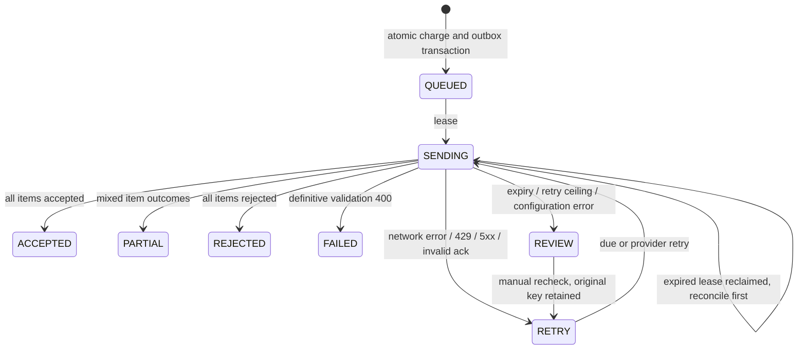

# Reliability and demonstration notes

The microservice deployment has two durable delivery boundaries: Charge-to-Billing HTTP jobs and Billing-to-external-system requests. Charge owns its outbox and result projection; Billing owns external attempts and acknowledgment state. No database is shared. See [the architecture](ARCHITECTURE.md) and [migration guide](MIGRATION.md).

If Patient service is unavailable, existing charge reads and exact mobile receipt retries still work; new edits and submissions return retryable errors until encounter validation recovers. If Billing service is unavailable, Charge continues queuing validated submissions. If Charge goes down after a handoff, Billing continues and retains the result for later projection. Gateway stays healthy independently of dependency outages; service-specific health checks report their own storage readiness.

## Billing state machine

The outbox is durable before the API returns 202. Outages do not lose charges. Retry delays are exponential 1s, 2s, 4s, 8s, 16s, capped at 30s plus up to 499ms jitter. A longer `Retry-After` wins. After ten attempts the worker parks the item in `REVIEW` to prevent an endless hot loop. Operational staff can identify review counts in `/v1/admin/metrics`; the owning provider can request a retry after an outage resolves. A production alerting/operations UI is outside this backend assignment.

The worker checks status before a repeated POST. Full valid acknowledgment means it commits the result without resending. A summary-only 200 or 404 leads to same-key replay only within 23 hours of the first attempted send. Queries failing with 429/5xx never cause a blind POST. Accepted local submissions are never claimed again.

## Exactly-once effects and ambiguity

The assignment says a billing `clientSubmissionId` is unique per submission attempt, while also requiring idempotent retries. Here **attempt means a logical submission**, not each HTTP transmission. Changing the key on every transport retry would defeat the stated exactly-once goal. A new key is generated only for a new immutable logical batch (including corrected rejected items).

Exactly-once effects rely on billing atomically persisting its idempotency receipt with accepted charges, honoring concurrent same-key requests, and returning consistent receipts. Those are external contract assumptions, not properties our database can enforce. Local charge IDs, permanent mobile receipts, database transactions and worker fences prevent duplicate local queuing.

There is no safe general algorithm that both automatically progresses and guarantees no duplicate billing after a 24-hour external key expires and the outcome is unknown. Therefore the worker stops POSTs after 23 hours and requires reconciliation. A full status response can still finalize an old submission. A 404 or partial summary after expiry is insufficient evidence. Charges stay locked in `REVIEW`. If a real billing system cannot supply item results, an operator must reconcile outside this app; there is deliberately no unsafe force-resubmit endpoint. The contract should be strengthened with indefinite charge-level idempotency and durable item-level lookup before promising unlimited-outage exactly-once behavior.

## Partial failure policy

| Failure | Durable behavior | Recovery |
|---|---|---|
| API process dies before transaction commit | Nothing committed | Mobile/broker retries same IDs |
| API response lost after commit | Receipt exists | Same IDs return committed result |
| Charge dispatcher dies during PUT | Outbox lease expires; Billing may already own job | Replay the same internal job ID and payload |
| Billing worker dies before/after POST | SENDING lease expires | Reclaim; query external billing; same-key replay if safe |
| Billing commits but response lost | Charges remain locked | Status reconciliation restores acknowledgment |
| Some items rejected | Accepted immutable, rejected editable | Correct rejected items and create a new batch |
| Invalid/incomplete acknowledgment | No item status changed | Retry/reconcile, then review after ceiling |
| Billing 400 | FAILED, charge errors retained | Correct drafts and submit a new logical batch |
| Patient prerequisite missing | WAITING inbox | Automatic/admin replay after source data arrives |
| New schema or invalid payload | QUARANTINED inbox | Review and publish corrected/new-version message |
| Stale mobile version | 409 with current authorized charge | Provider resolves and sends a new operation |

Hospital billing endpoints live in trusted `hospitals.billing_url` configuration; clients cannot supply arbitrary URLs. The worker deliberately disables redirects and bounds response bodies. One slow hospital can delay this single worker; more same-host workers can help the demo, while production should add per-hospital concurrency budgets/circuit breaking for fairness.

## Operational boundaries

The database uses WAL and FULL synchronous mode. Named Docker volumes retain app/mock data across container restarts. Back up SQLite through its backup API or a coordinated consistent snapshot including WAL; copying just an active `.db` file is not a backup strategy. Backups/encryption/retention automation are not implemented. Schema is version 1 and initialized idempotently; future schema evolution needs explicit migrations instead of modifying the bootstrap SQL in place.

Each domain service's health endpoint checks its own database, not dependency availability. Worker failures log safe codes only. Gateway metrics expose counts grouped by service. Audit/revision tables are append-only through triggers; query `/v1/admin/audit?service=patient|charge|billing` with an independent cursor for each. Before production, add latency/error histograms, queue-age alerts, per-hospital fairness, audit export, shared rate limits, and revision retention governance. Repeated missing prerequisites currently re-audit at each replay and may require tuning on a large backlog.

## Suggested walkthrough (60–90 minutes)

1. **Requirements and architecture (10 minutes):** Open ARCHITECTURE.md, explain service ownership, private databases, tenant boundaries, and durable HTTP handoff.
2. **Run the demo (10 minutes):** `npm run demo:start` then `npm run demo`; inspect HTTP examples and durable state. Everything uses synthetic data.
3. **Patient consumer (10 minutes):** Walk through `consume`, inbox keys, savepoints, quarantine, independent field clocks, and what strict timestamp ordering would require.
4. **Mobile/charge flows (10 minutes):** Show stable IDs, payload digests, conflict responses, immutable revisions, remote encounter validation and atomic local queuing.
5. **Billing resilience (15 minutes):** Explain leases versus idempotency, lost acknowledgments, mixed results, safe expiry review, and correcting only rejected items.
6. **Tests and trade-offs (10 minutes):** Run tests; discuss SQLite blocking, PostgreSQL migration, broker transport, real authentication, hospital timezone policy and audit storage.
7. **Discussion (remaining time):** What external guarantees are missing? How would you demonstrate crash recovery? What changes first at higher load?

## Assignment coverage

| Requirement | Implementation/evidence |
|---|---|
| Architecture/ER diagrams, module rationale | ARCHITECTURE.md |
| Option A: Charge Submission | services/charge-service; services/billing-service |
| Option B: Patient Sync | services/patient-service; six events; durable inbox and replay |
| Option C: Offline Coordinator | Charge /v1/sync, operation receipts, compare-and-swap versions |
| Integration specification | INTEGRATION.md, executable Zod schemas |
| Tenant isolation/security | Authenticated principals, composite keys, role checks, bounded input |
| Clinical notes/audit | Draft snapshots, charge revisions, audit, original source envelopes |
| Outages/partial acceptance | Leased outbox, backoff, reconciliation, per-item outcomes |
| Standalone mocks and seeds | Patient seed, services/billing-mock, scripts/demo.ts |
| Local/container run | npm run demo:start; per-project Dockerfiles; compose.yaml |
| Testable edge cases | tests/patient.test.ts, billing.test.ts, microservices.test.ts, migration.test.ts |
